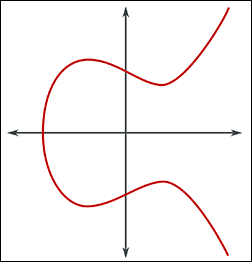

# **Blockchain CheatSheet - Cryptographie & Signatures**

<b>&#x1F553; Temps de lecture : 6 min</b>

---

##### **Table des matières**

###### [§ Fondamentaux](#-Fondamentaux-1)

- [Cryptoanalyse](#Cryptoanalyse)
- [Cryptographie](#Cryptographie)
- [Chiffres](#Chiffres)

###### [§ Chiffres Symétriques](#-Chiffres-Sym%C3%A9triques-1)

- [Chiffres Symétriques Monoalphabétiques](#Chiffres-Sym%C3%A9triques-Monoalphab%C3%A9tiques)
- [Chiffres Symétriques Polyalphabétiques](#Chiffres-Sym%C3%A9triques-Polyalphab%C3%A9tiques)

###### [§ Signatures Numériques Symétriques](#-Signatures-Num%C3%A9riques-Sym%C3%A9triques-1)

- [Échanges de Clés Diffie-Hellman](#%C3%89changes-de-Cl%C3%A9s-Diffie-Hellman)

###### [§ Signatures Numériques Asymétriques](#-Signatures-Num%C3%A9riques-Asym%C3%A9triques-1)

- [RSA (Rivest Shamir Adleman)](#rsa-Rivest-Shamir-Adleman)
- [Opérations ECC (Cryptographie sur Courbes Elliptiques)](#ecc-Op%C3%A9rations-Cryptographie-sur-Courbes-Elliptiques)
- [ECDSA (Algorithme de Signature Numérique sur Courbe Elliptique)](#ecdsa-Algorithme-de-Signature-Num%C3%A9rique-sur-Courbe-Elliptique)

## **§ Fondamentaux**

### Cryptoanalyse

- **Définition** : L'art du décryptage, c'est-à-dire l'analyse et la surmontée des systèmes cryptographiques.

### Cryptographie

- **Définition** : L'art du chiffrement, c'est-à-dire la pratique de la protection des informations à l'aide de chiffres.

### Chiffres

- **Définition** : Règles utilisées pour chiffrer les données.
    - **Symétrique** : Utilise la même clé pour le chiffrement et le déchiffrement.
    - **Asymétrique** : Utilise une paire de clés, une clé publique pour le chiffrement et une clé privée pour le déchiffrement.
- **Protocoles** : Ensembles de règles qui déterminent comment les opérations de chiffrement et de déchiffrement doivent être effectuées.
- **Propriétés des Chiffres Valides** :
    1. Facile à chiffrer
    2. Facile à transmettre
    3. Facile à déchiffrer
    4. Difficile à déchiffrer en cas d'interception
    5. La source des données doit être validée

---

## **§ Chiffres Symétriques**

### Chiffres Symétriques Monoalphabétiques

- **Définition** : Utilisent une seule substitution fixe entre le texte en clair et le texte chiffré.

Exemple d'Alphabet Chiffre (Inverse)

|Alphabet|A|B|C|...|K|L|M|N|O|...|Z|
|---|---|---|---|---|---|---|---|---|---|---|---|
|**Inverse**|**Z**|**Y**|**X**|**...**|**P**|**O**|**N**|**M**|**L**|**...**|**A**|

Exemple de Chiffrement

|H|E|L|L|O|
|---|---|---|---|---|
|**S**|**V**|**O**|**O**|**L**|

### Chiffres Symétriques Polyalphabétiques

Phrase à chiffrer : "HELLO WORLD" Clé répétée : "KEYKEYKEYKE"

|Message|H|E|L|L|O|W|O|R|L|D|
|---|---|---|---|---|---|---|---|---|---|---|
|Clé Répétée|K|E|Y|K|E|Y|K|E|Y|K|
|Message (nombres)|7|4|11|11|14|22|14|17|11|3|
|Clé (nombres)|10|4|24|10|4|24|10|4|24|10|
|Somme mod 26|17|8|9|21|18|20|24|21|9|13|
|Chiffré|R|I|J|V|S|U|Y|V|J|N|

---

## **§ Signatures Numériques Symétriques**

Échange de Clés Symétriques

- **Utilisation des Clés** : Utilise une seule clé pour la signature et la vérification.
- **Vitesse** : Généralement plus rapide car il utilise des algorithmes plus simples.
- **Gestion des Clés** : La distribution des clés peut être difficile car la même clé doit être partagée de manière sécurisée entre les parties.
- **Cas d'utilisation** : Couramment utilisé dans les scénarios où les deux parties partagent déjà une clé secrète, comme dans les systèmes fermés.

### Échanges de Clés Diffie-Hellman

**Définition** : L'échange de clés Diffie-Hellman est un algorithme de partage de secrets qui retourne les composants nécessaires aux opérations arithmétiques pour générer une clé secrète partagée.

**Processus** :

1. **Établir les Composants Publics** :
    
    - **Modulo (M)** : Un grand nombre premier utilisé comme dividende mathématique.
    - **Générateur (G)** : Un nombre de base utilisé pour l'exponentiation.
2. **Clés Privées** :
    
    - Chaque partie génère sa propre clé privée (**PrK**).
3. **Opérations Arithmétiques** :
    
    - Chaque partie effectue l'opération suivante en utilisant sa clé privée :
        
        **GPrK mod M**
        
    - Le reste (R) de cette opération est partagé entre les parties.
        
4. **Dévoilement du Secret** :
    
    - Chaque partie prend ensuite le reste reçu (**R**) et effectue l'opération suivante en utilisant sa clé privée :
        
        **RPrK mod M**
        
    - Le reste final (**LR**) sera le même pour les deux parties et servira de clé commune pour le chiffrement et le déchiffrement.
        

**Sécurité** :

- Aucun attaquant ne peut déchiffrer la clé secrète partagée (**LR**) en connaissant uniquement **G**, **M**, et **R** sans accès aux clés privées (**PrK**) des parties impliquées.

---

## **§ Signatures Numériques Asymétriques**

### RSA (Rivest Shamir Adleman)

**Génération des Clés** :

- Générer deux nombres premiers A et B.
- Calculer Max = A × B.
- Calculer φ(Max) = (A-1) × (B-1).
- Choisir un exposant public e.
- Calculer l'exposant privé d comme l'inverse multiplicatif modulaire de e modulo φ(Max).

La sécurité de RSA repose sur la difficulté de factoriser Max en A et B. Sans les nombres premiers A et B, il est très difficile de calculer la clé privée d si seulement Max est connu.

Les attaques par force brute pour trouver d nécessiteraient de factoriser Max, ce qui est computationnellement difficile pour des nombres suffisamment grands.

- **Déchiffrement** : Utilise la clé privée (d, Max).
- **Génération de Clé Privée** : Nécessite les nombres premiers A et B.
- **Attaques par Factorisation** : Un attaquant qui souhaite trouver d sans connaître A et B doit factoriser N, un problème connu pour être difficile.

**Faiblesses** :

- La factorisation de Max est possible en le divisant par des nombres premiers à la recherche de la paire originale.

### Opérations ECC (Cryptographie sur Courbes Elliptiques)

**Comparaisons** : Pour atteindre le niveau de sécurité d'une clé de 256 bits avec ECC, il vous faudrait une clé de 3072 bits avec RSA. Dans les cas d'utilisation réels, un niveau de sécurité top secret gouvernemental implique une clé de 384 bits avec ECC, ce qui nécessiterait une clé de 7680 bits avec RSA.

**Formule** :

Y2 = X3 + ax + b

Si vous tracez une ligne droite partant d'un point sur la courbe (A) dans le plan positif Y pour intercepter un autre point sur la même courbe (B), la ligne touchera inévitablement un troisième point (C).

En utilisant la symétrie de la courbe elliptique par rapport à l'axe des X, en projetant le troisième point (C) dans le plan Y négatif et en le reliant au point original (A), vous obtiendrez un quatrième point (D).

En répétant cette dernière opération (multiplication scalaire) N fois, le nombre d'opérations de multiplication scalaire effectuées sera notre clé privée !

**Résumé** :

1. **Intersection des Points sur une Courbe Elliptique** :
    - En traçant une ligne droite qui intersecte deux points sur la courbe elliptique (A et B), cette ligne touchera inévitablement un troisième point (C) sur la courbe.
2. **Symétrie par rapport à l'Axe des X** :
    - En réfléchissant le troisième point (C) par rapport à l'axe des X, un nouveau point (D) est obtenu sur la courbe.
3. **Répétition de l'Opération (Addition de Points)** :
    - La répétition de cette opération d'addition de points N fois génère une séquence de points sur la courbe.
4. **Clé Privée** :
    - Le nombre d'opérations d'addition de points effectuées (N) sera notre clé privée.

> BTC utilise Y2 = X3 + 0 * x + 7 = **X3 + 7**

### ECDSA (Algorithme de Signature Numérique sur Courbe Elliptique)

Clé publique : nous prenons une clé privée ou, en d'autres termes, une clé de signature secrète puis nous générons une clé publique liée via les opérations sur la courbe elliptique sous forme de coordonnées ( x1, y1 )

La signature : Nous utilisons les données, un Nonce (nombre aléatoire) et la clé privée et nous utilisons ces éléments dans une opération de courbe elliptique qui renverra une signature numérique sous forme de coordonnées ( r, s ) publiques.

Vérification des signatures : Nous utilisons les données, les coordonnées comme signatures et la clé publique, nous les utilisons avec les opérations sur la courbe elliptique pour obtenir deux nouvelles coordonnées ( x2, y2 ), puis nous effectuons un module en utilisant x2 comme base. Si nous obtenons x1, la signature est vérifiée.

> Remarque : Cela prouve élégamment que la personne ayant la clé privée a généré les données. Et la signature est toujours différente en fonction de l'entité des données.

---

###### Suivi suggéré

[**Blockchain CheatSheet - Utilisation Technique**](blockchain-technical-use-cheatsheet.md)

---

**Auteur** : Kenneth Boldrini