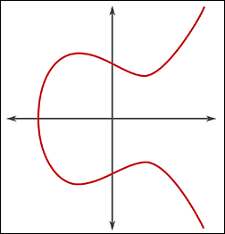

# **Blockchain CheatSheet - Crittografia & Firme**

<b>&#x1F553; Tempo di lettura: 6 min</b>

---

##### **Indice**

###### [§ Fondamenti](#-Fondamenti-1)
- [Cryptoanalisi](#Cryptoanalisi)
- [Crittografia](#Crittografia)
- [Cifrari](#Cifrari)
###### [§ Cifrari Simmetrici](#-Cifrari-Simmetrici-1)
- [Cifrari Simmetrici Monoalfabetici](#Cifrari-Simmetrici-Monoalfabetici)
- [Cifrari Simmetrici Polialfabetici](#Cifrari-Simmetrici-Polialfabetici)
###### [§ Firme Digitali Simmetriche](#-Firme-Digitali-Simmetriche-1)
- [Scambio di Chiavi Diffie-Hellman](#Scambio-di-Chiavi-Diffie-Hellman)
###### [§ Firme Digitali Asimmetriche](#-Firme-Digitali-Asimmetriche-1)
- [RSA (Rivest Shamir Adleman)](#rsa-Rivest-Shamir-Adleman)
- [Operazioni ECC (Crittografia a Curve Ellittiche)](#ecc-Operazioni-Crittografia-a-Curve-Ellittiche)
- [ECDSA (Algoritmo di Firma Digitale a Curva Ellittica)](#ecdsa-Algoritmo-di-Firma-Digitale-a-Curva-Ellittica)

## **§ Fondamenti**

### Cryptoanalisi

- **Definizione**: L'arte della decrittazione, cioè l'analisi e la superazione dei sistemi crittografici.

### Crittografia

- **Definizione**: L'arte della cifratura, cioè la pratica di proteggere le informazioni usando cifrari.

### Cifrari

- **Definizione**: Regole utilizzate per cifrare i dati.
    - **Simmetrici**: Usano la stessa chiave per cifrare e decifrare.
    - **Asimmetrici**: Usano una coppia di chiavi, una pubblica per cifrare e una privata per decifrare.
- **Protocolli**: Insiemi di regole che determinano come devono essere eseguite le operazioni di cifratura e decifratura.
- **Proprietà dei Cifrari Valid**:
    1. Facile da cifrare
    2. Facile da trasmettere
    3. Facile da decifrare
    4. Difficile da decifrare se intercettato
    5. La fonte dei dati deve essere convalidata

---

## **§ Cifrari Simmetrici**

### Cifrari Simmetrici Monoalfabetici

- **Definizione**: Utilizzano una sola sostituzione fissa tra testo in chiaro e testo cifrato.

Esempio di Alfabeto Cifrato (Inverso)

|Alfabeto|A|B|C|...|K|L|M|N|O|...|Z|
|---|---|---|---|---|---|---|---|---|---|---|---|
|**Inverso**|**Z**|**Y**|**X**|**...**|**P**|**O**|**N**|**M**|**L**|**...**|**A**|

Esempio di Cifratura

|H|E|L|L|O|
|---|---|---|---|---|
|**S**|**V**|**O**|**O**|**L**|

### Cifrari Simmetrici Polialfabetici

Messaggio da cifrare: "HELLO WORLD" Chiave ripetuta: "KEYKEYKEYKE"

|Messaggio|H|E|L|L|O|W|O|R|L|D|
|---|---|---|---|---|---|---|---|---|---|---|
|Chiave Ripetuta|K|E|Y|K|E|Y|K|E|Y|K|
|Messaggio (numeri)|7|4|11|11|14|22|14|17|11|3|
|Chiave (numeri)|10|4|24|10|4|24|10|4|24|10|
|Somma mod 26|17|8|9|21|18|20|24|21|9|13|
|Cifrato|R|I|J|V|S|U|Y|V|J|N|

---

## **§ Firme Digitali Simmetriche**

Scambio di Chiavi Simmetriche

- **Uso delle Chiavi**: Utilizza una sola chiave per sia la firma che la verifica.
- **Velocità**: Generalmente più veloce perché utilizza algoritmi più semplici.
- **Gestione delle Chiavi**: La distribuzione delle chiavi può essere complicata poiché la stessa chiave deve essere condivisa in modo sicuro tra le parti.
- **Caso d'Uso**: Comunemente usato in scenari in cui entrambe le parti già condividono una chiave segreta, come nei sistemi chiusi.

### Scambio di Chiavi Diffie-Hellman

**Definizione**: L'algoritmo di Scambio di Chiavi Diffie-Hellman è un algoritmo di condivisione segreta che restituisce le componenti necessarie per le operazioni aritmetiche per generare una chiave segreta condivisa.

**Processo**:

1. **Stabilire Componenti Pubbliche**:
    
    - **Modulus (M)**: Un grande numero primo usato come dividendo matematico.
    - **Generatore (G)**: Un numero base usato per l'esponenziazione.
2. **Chiavi Private**:
    
    - Ogni parte genera la propria chiave privata (**PrK**).
3. **Operazioni Arimetiche**:
    
    - Ogni parte esegue l'operazione seguente usando la propria chiave privata:
        
        **GPrK mod M**
        
    - Il resto (R) di questa operazione viene condiviso tra le parti.
        
4. **Rivelazione del Segreto**:
    
    - Ogni parte prende quindi il resto ricevuto (**R**) e esegue l'operazione seguente usando la propria chiave privata:
        
        **RPrK mod M**
        
    - Il resto finale (**LR**) sarà lo stesso per entrambe le parti e servirà come chiave comune per la cifratura e decifratura.
        

**Sicurezza**:

- Nessun attaccante può decifrare la chiave segreta condivisa (**LR**) solo conoscendo **G**, **M** e **R** senza accesso alle chiavi private (**PrK**) delle parti coinvolte.

---

## **§ Firme Digitali Asimmetriche**

### RSA (Rivest Shamir Adleman)

**Generazione delle Chiavi**:

- Generare due numeri primi A e B.
- Calcolare Max = A × B.
- Calcolare φ(Max) = (A-1) × (B-1).
- Scegliere un esponente pubblico e.
- Calcolare l'esponente privato d come l'inverso moltiplicativo modulare di e modulo φ(Max).

La sicurezza di RSA si basa sulla difficoltà di fattorizzare Max in A e B. Senza i numeri primi A e B, è molto difficile calcolare la chiave privata d se si conosce solo Max.

Gli attacchi brute-force per trovare d richiederebbero la fattorizzazione di Max, che è computazionalmente difficile per numeri sufficientemente grandi.

- **Decifratura**: Utilizza la chiave privata (d, Max).
- **Generazione della Chiave Privata**: Richiede i numeri primi A e B.
- **Attacchi di Fattorizzazione**: Un attaccante che desidera trovare d senza conoscere A e B deve fattorizzare N, un problema noto per essere difficile.

**Debolezze**:

- La fattorizzazione di Max è possibile dividendo Max per numeri primi in cerca della coppia originale.

### Operazioni ECC (Crittografia a Curve Ellittiche)

**Confronti**: Per raggiungere il livello di sicurezza di una chiave a 256 bit con ECC, è necessario una chiave a 3072 bit con RSA. Nei casi d'uso reali, un livello di sicurezza top secret governativo implica una chiave a 384 bit con ECC, che richiederebbe una chiave a 7680 bit con RSA.

**Formula**:

Y2 = X3 + ax + b

Se disegni una linea retta che parte da un punto sulla curva (A) nel piano Y positivo per intercettare un altro punto sulla stessa curva (B), la linea toccherà inevitabilmente un terzo punto (C).

Utilizzando la simmetria della curva ellittica rispetto all'asse X, proiettando il terzo punto (C) nel piano Y negativo e collegandolo con il punto originale (A), otterrai un quarto punto (D).

Ripetendo questa ultima operazione (moltiplicazione scalare) N volte, il numero di operazioni di moltiplicazione scalare eseguite sarà la nostra chiave privata!

**Riassunto**:

1. **Intersezione di Punti su una Curva Ellittica**:
    - Disegnando una linea retta che interseca due punti su una curva ellittica (A e B), questa linea toccherà inevitabilmente un terzo punto (C) sulla curva.
2. **Simmetria rispetto all'asse X**:
    - Riflettendo il terzo punto (C) rispetto all'asse X, si ottiene un nuovo punto (D) sulla curva.
3. **Ripetizione dell'Operazione (Addizione di Punti)**:
    - Ripetendo questa operazione di addizione di punti si genera una sequenza di punti sulla curva.
4. **Chiave Privata**:
    - Il numero di operazioni di addizione di punti eseguite (N) sarà la nostra chiave privata.

> BTC utilizza Y2 = X3 + 0 * x + 7 = **X3 + 7**

### ECDSA (Algoritmo di Firma Digitale a Curva Ellittica)

Chiave pubblica: Prendiamo una chiave privata o, in altre parole, una chiave segreta di firma, e generiamo una chiave pubblica associata tramite operazioni su curve ellittiche come coordinate (x1, y1).

La firma: Utilizziamo i dati, un nonce (numero casuale) e la chiave privata e applichiamo queste operazioni su curve ellittiche per ottenere una firma digitale in coordinate (r, s) che sono pubbliche.

Verifica delle firme: Utilizziamo i dati, le coordinate come firme e la chiave pubblica per eseguire operazioni su curve ellittiche che generano due nuove coordinate (x2, y2). Poi facciamo un modulo usando x2 come base; se otteniamo x1, la firma è verificata.

> Nota: Questo dimostra elegantemente che la persona con la chiave privata ha generato i dati. E la firma è sempre diversa in base all'entità dei dati.

---

###### Seguito suggerito

[**Blockchain CheatSheet - Uso Tecnico**](blockchain-technical-use-cheatsheet.md)

---

**Autore**: Kenneth Boldrini